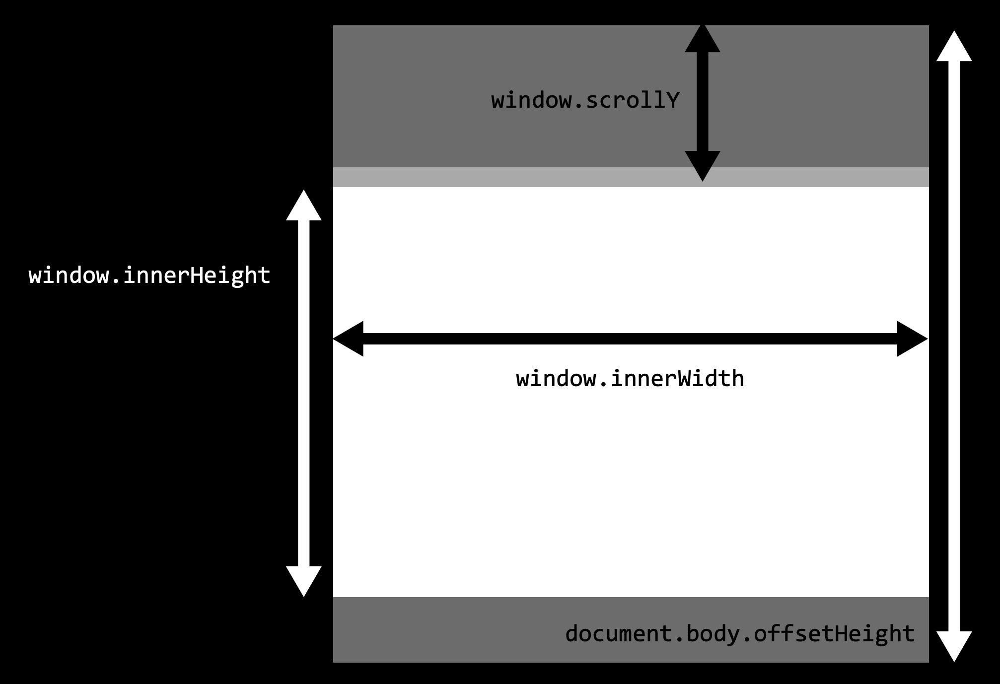

# Learning notes

## Debounce - How to delay a function

The `debounce` is a special function that handles two tasks:

- Allocating a scope for the timer variable
- Scheduling your function to be triggered at a specific time

There are several JS libraries already contain `debounce` implementation (Lodash, JQuery, Underscore, etc).

## Window Sizes and Scrolling

For this type of information, we can use the root document element document.documentElement, that corresponds to the `<html>` tag.

### Width/heigh ot the Window

To get window width and height, we can used the `clientWidth/clientHeight` of `document.documentElement`.

For instance, this button shows the height of your window:

```js
alert(document.documentElement.clientHeight);
```

Browsers also support properties like `window.innerWidth/innerHeight`. They look like what we want, so why not to use them instead?

If there exists a scrollbar, and it occupies some space, `clientWidth/clientHeight` provide the width/height without it (subtract it). In other words, they return the width/height of the visible part of the document, available for the content.

`window.innerWidth/innerHeight` includes the scrollbar.

```js
alert(window.innerWidth); // full window width
alert(document.documentElement.clientWidth); // window width minus the scrollbar
```

### Width/Height of the Document

Theoretically, as the root document element is document.documentElement, and it encloses all the content, we could measure the document’s full size as`document.documentElement.scrollWidth/scrollHeight`.

But on that element, for the whole page, these properties do not work as intended. In Chrome/Safari/Opera, if there’s no scroll, then `documentElement.scrollHeight` may be even less than `documentElement.clientHeight`! Weird, right?

To reliably obtain the full document height, we should take the maximum of these properties:

```js
let scrollHeight = Math.max(
  document.body.scrollHeight,
  document.documentElement.scrollHeight,
  document.body.offsetHeight,
  document.documentElement.offsetHeight,
  document.body.clientHeight,
  document.documentElement.clientHeight
);

alert("Full document height, with scrolled out part: " + scrollHeight);
```

### Get the current Scroll

DOM elements have their current scroll state in their `scrollLeft/scrollTop` properties.

For document scroll, `document.documentElement.scrollLeft/scrollTop` works in most browsers.

Luckily, we don’t have to remember these peculiarities at all, because the scroll is available in the special properties, `window.pageXOffset/pageYOffset`:

```js
alert("Current scroll from the top: " + window.pageYOffset);
alert("Current scroll from the left: " + window.pageXOffset);
```

For historical reasons, both properties exist, but they are the same:

- `window.pageXOffset` is an alias of `window.scrollX`.
- `window.pageYOffset` is an alias of `window.scrollY`.


