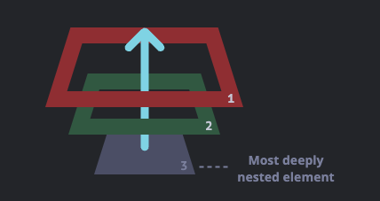
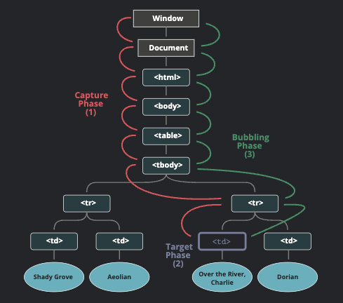

# Learning Notes

## Bubbling and Capturing

When an event happens on an element, it first runs the handlers on it, then on its parent, then all the way up on other ancestors.

Let’s say we have 3 nested elements FORM > DIV > P with a handler on each of them:

```html
<style>
  body * {
    margin: 10px;
    border: 1px solid blue;
  }
</style>

<form onclick="alert('form')">
  FORM
  <div onclick="alert('div')">
    DIV
    <p onclick="alert('p')">P</p>
  </div>
</form>
```

A click on the inner `<p>` first runs `onclick`:

1. On that `<p>`
2. Then on the outer `<div>`
3. Then on the outer `<form>`
4. And so on upwards till the `document` object.



So if we click on `<p>`, then we’ll see 3 alerts: `p` → `div` → `form`.

The process is called “bubbling”, because events “bubble” from the inner element up through parents like a bubble in the water.

A handler on a parent element can always get the details about where it actually happened.

The most deeply nested element that caused the event is called a target element, accessible as `event.target`.

### Stoping bubbling

A bubbling event goes from the target element straight up. Normally it does upwards till `<html>`, and then to `document` object, and some events even reach `window`, calling all handlers on the path.

But any handler may decide that the event has been fully processed and stop the bubbling.

The method for it is `event.stopPropagation()`. For instance, here `body.onclick` doesn't work if you click on `<button>`:

```html
<body onclick="alert(`the bubbling doesn't reach here`)">
  <button onclick="event.stopPropagation()">Click me</button>
</body>
```

### Capturing

There's another phase of event processing called **capturing**. It is rarely used in real code, but sometimes can be useful.

The standard DOM Events describes 3 phases of event propagation:

1. Capturing phase - the event goes down to the element
2. Target phase - the event reached the target element
3. Bubbling phase - the event bubbles up from the element.


